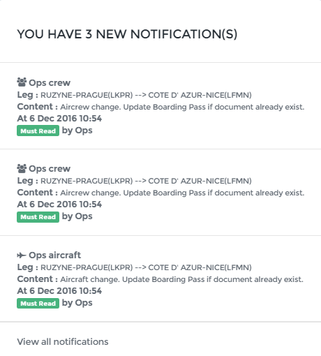
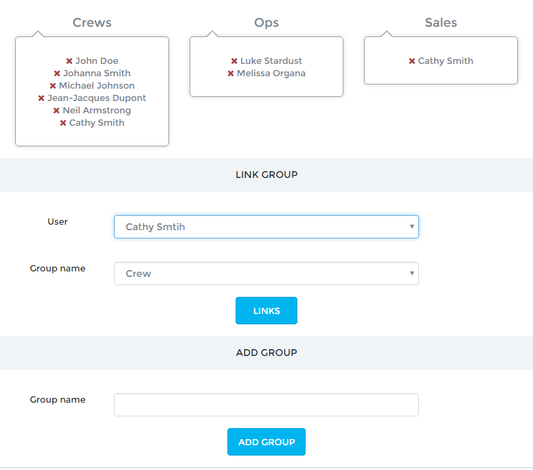

Notifications
=============

Role notifications
------------------

For OPS or Sales roles, notifications will display important informations regarding flight creations, updates and cancellations. This notification system is designed to ensure no informations are lost between sales and operations.

Click on the warning logo to displays latest notifications:

To acknowledge the notification click on the status button ("must read").

Flight reports comment and Groups
---------------------------------

Pilots can send a comment in a flight report through their App. The comment is to be send to one or several groups. Groups are managed by the admin on the page **Configure > Groups**.

You may create any group with any name using the last section and and any user to any group using the middle section.

E-mail notifications
--------------------

E-mail notification to the users are possible for various topics:

- Reservation on an uncategorized airport
- Fatigue Reports
- Expiration dates

To enable these notifications, contact Openjet Support.

On the page **Configure > Notification**, choose which groups should receive the notifications.
