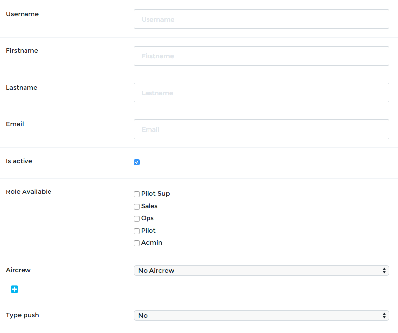

Manage Users
============

User management is accessible through the menu **User > User list**. The right to manage users is by default granted to the **Admin** role. Remember: this can be changed as you prefer, contact support@openjet.com for any changes related to roles and rights.

To view and edit an existing user, click on the eye. To create a new user, click **Add New**. The form for creating or editing a user are the same, except for the passwords fields.

Create a User
-------------

Fill out all the fields in the form. We recommend to use the Email as username.

Check **Is active** to activate this user access.

If the user is to be linked to an existing aircrew, select the aircrew in the list.

Select **Mail** for the **Type push** field.

Choose a password and submit. The user is now created and active.

Desactivate a user
------------------

To deactivate a user, just un-click **Is active**. The access for the user is then suspended.
