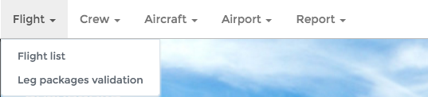

General Principles
==================

This guide covers the features available in OpenJet 360.

Overview
--------

OpenJet 360 allows your company to manage:

- Customers
- Reservations
- One click edition for Quotations, Flight Confirmation, Pro Forma, Invoices and Boarding Pass
- Pricing
- Fleet
- Crew (Expiration dates monitoring, FTL monitoring, planning etc.)
- Planning
- Flight Schedule

And much more.

Support
-------

If you have any trouble using your OpenJet platform, please send an email to support@openjet.com. 

Should you encounter an issue or a bug, please send an email to the same address or, in case of emergency (e.g. platform malfunction), call Openjet Support Team on + 352 20 88 04 93.

Our Support Team is available anytime for you.

Update
------

The Back Office platform is updated on a regular basis. You will receive a warning e-mail before the update. 

The platform will then become unavailable for a few minutes maximum. Should the planned update-time interfere with your operation, please let us know.

User and roles
--------------

Each individual in your company can have private access to the platform. Each access is granted one ore more roles. 
The common roles are OPS, Sales, Pilot, Pilot Supervisor and Admin. 

We will set up your platform with these standard roles, but you can completely customize your roles (and their rights) to match your company’s way of working. 

For example, if you want your OPS agent’s to access the pricing area or the Sales Agent to access the flight schedule, it is possible. 

For more information, see the Manage your Users.

Login Page
----------

This is the login page. Type you username or email address to access your OpenJet platfom.

.. image:: images/login-page_v3.png
    :align: center

If you have forgotten your password, click on “Forgot Password ?”, enter your email address and submit. 

You will receive a new password by email. You can then change it here if you prefer:

.. image:: images/change-password.png
    :align: center

Home Page
---------

**Dashboard**

After login, you start on the Dashboard. Your Company admin can display some Widgets on the Dashboard (Aircraft/crew location, Flight hours etc.). Refer to “Client Root” section for more information.

**User status**

The top right corner contains information about the user status:

From left to right:

- User name.
- Role button: you can switch role any time (OPS/Sales/Admin) by clicking on the role button.
- Notification warning: if you have any unread notification, this warning will display in red with the number of notifications.
- User settings: you can set here your email signature, change your password.

**Menu Bar**

The menu bar changes according to the current role. Each menu item is linked to a specific right. To change the rights attached to a role, contact support@openjet.com.

**Side Bar**

.. image:: images/sidebar_v1.png
    :align: center

On pages which displays a list, you can manage views to show the list with different columns/info. To access this functionality, click on “Manages Views”. 
You can then create a personal view and/or choose the default view. You can switch your view any time via the side bar.

The side bar also displays the last visited pages.

You can hide the side bar by clicking on the arrow.