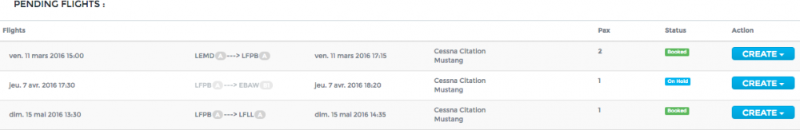
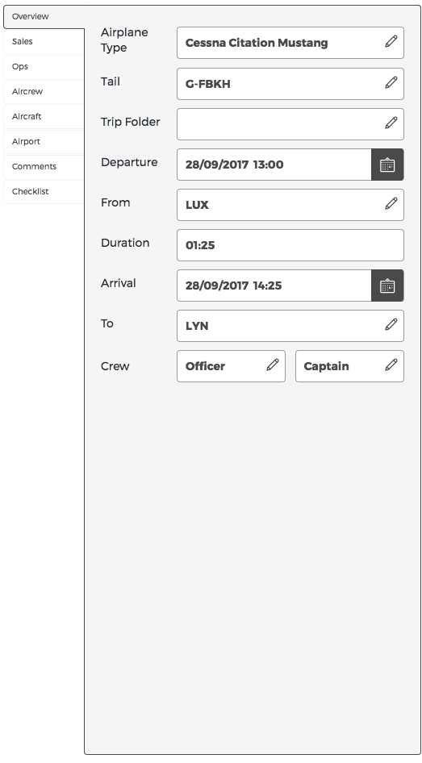

Flight List
===========

Flight operations are managed on the page **Flight > Flight list**.

Pending Flights
---------------

Pending flights are flights sent by Sales awaiting aircraft and crew assignation. A confirmed reservation will appear in dark grey with the status booked, whereas an optioned reservation will be in light grey with the status on hold, as shown below.

You have four possibilities to handle this flight request. To access these possibilities, click on |create|

- Try Auto-Book: the optimization unit of Openjet will try to find a solution for you, which you can accept or not.
- Create Mission: you will manually assign an aircraft and crew. The flight will then be moved to the section below.
- Add to Mission: if the flight can be added to an existing mission, this option will be shown. Select desired mission and the leg will be automatically added to existing mission.
- Decline: if you cannot perform this flight, choose “Decline”. Sales will have to find another solution (e.g. Chartering).

Flights
-------

This section displays all flights planned or waiting for assignation. The flights are ordered chronologically according to their departure date and time.

A flight with no assigned aircraft will appear in dark grey. Once an aircraft has been assigned, the flight will change its color to the aircraft color.

It is possible to group several legs into a “mission”. See further below how to do it.

Legs
----

Legs are displayed like this: 

From left to right: Departure Airport / Departure Airport Category (if defined by operator) / Type of leg (Arrow) / Arrival Airport / Arrival Airport Category.

The leg arrow will be different according to the type of leg:

- Commercial leg: 
- Empty Leg: 
- Leg changed:  means Sales has amended this leg (e.g. departure time). Open leg edit (see below) to see what has changed.
- Leg deleted:  means leg or reservation has been cancelled by Sales. OPS needs to remove it from planning or replace it with an empty leg.

Group legs
^^^^^^^^^^

To group legs already in the flight list to a mission, click on the leg arrow. In the pop-up, click on  and choose a mission below “Extract to mission”.

Aircraft assignment
^^^^^^^^^^^^^^^^^^^

To assign an aircraft to a mission, click on the dash in the Aircraft column, choose aircraft type and tail number. If an aircraft is already busy, it will show “busy” next to its tail number.

Crew assignment
^^^^^^^^^^^^^^^

To assign a crew to a mission, click on the dash in the Aircraft column and select a crew in the left and right seat. Crew are ordered according to the pairing possibilities and airport qualification (if applicable). If a crew has a secondary role defined (e.g. TRI, TRE), the choice will appear in a third box.

Leg details
^^^^^^^^^^^

To access leg details, click on the leg arrow. This pop-up will appear:

- Click on  to edit departure time, airports, FBO and flight time.
- Once the NOTAMs have been checked, check the box and add important information regarding notams for the crew, then click on “Save NOTAM”.
- By clicking on  you can extract the flight to a new or another mission, add a comment to the leg or delete the leg.
- If CFMU informations* (Europe) are enabled for your company, informations will display as follows:

- The three boxes below the action button are linked to the “OPS” indicator in the status panel. “Category” will appear green if the airports have been categorized. You can check the boxes if you have checked that all Visa and overflight/landing permits matters have been dealt with. Once all three boxes are green, the “OPS” indicator will turn green.
- By clicking on  you can change the flight type (e.g. commercial, private, general aviation, training). Changing the flight type can have an impact on FTL calculation, depending on the regulation applying.
- Commercial: in this section you can see the customer’s name and comments added by Sales.
- Logs: the logs displays the changes made to the leg, since its creation.

Status Panel
^^^^^^^^^^^^

The status panel gives you an overview of the mission. If there is no red on the panel, all flights of the mission are OK to be performed.

- **Routing:** red means there is a routing error (departure airport different than arrival airport) with previous or next leg.
- **Sales:** red means that a change has occurred on the sales side. Check leg arrows.
- **OPS:** shows green if the three boxes in the legs details are green, for all legs of the mission.
- **Aircraft:** shows green if aircraft has been assigned.
- **NOTAM:** shows green if NOTAMs have been checked for all legs.
- **FBO:** click on the indicator to manage and send your FBO request for the mission. Select the legs for which you wish to send the request and click send. You will receive a copy of the request in the default OPS email. You can manually switch the status for each FBO request. Turn it green when the FBO has acknowledged the request.
- **Crew:** if a correct crew has been assigned, it will show green.
- **Pilot App:** red means that no leg has been acknowledged by the crew, blue means it has been partially acknowledged (click on indicator for details) and green means the mission has been entirely acknowledged.
- **FTL:** this box will show orange (warning) or red (alarm) if there is any FTL issue, green otherwise. Click on the indicator to view the error message. A link will guide you to the pilot’s planning for more information.
- **Qualif:** if an airport needs a qualification, this indicator will show red until a qualified captain has been assigned. It will then show green. If qualification required only in some weather conditions, it will show orange if the captain is not qualified.
- **Extended:** shows green if the duty is extended according to FTL regulation (Europe)
- **Split:** shows green if the duty is split according to FTL regulation (Europe)
- **Hotel:** click on the indicator to set the hotel booking status. If you check a “to do” or “requested” box, indicator will show red or blue (if an “ok” box is also checked) and green if only “ok” boxes are checked.
- **Catering:** this indicator works like the hotel indicator.
- **Service:** this indicator works like the hotel indicator.
- **Comment:** click on this indicator to add any comment.
- **Cojetage:** if there is an empty leg in the mission, it will show blue. You can click on the indicator to add the flight to Cojetage (if applicable).

Leg package Validation
----------------------

This page is a tool to follow your checks on the leg packages provided by your crews after flights.
To validate one or several leg packages, click on the desired checkboxes and validate.

.. note:: You can customize the list by clicking on “Manage views” in the side bar.

Flight routing errors
---------------------

This page contains the inventory of all flight routing errors, in a much more visible way than the flight list.

.. note:: The CFMU service is being created and provided using electronic data products which have been created and made available by the European Organisation for the Safety of Air Navigation (EUROCONTROL). All rights reserved.

