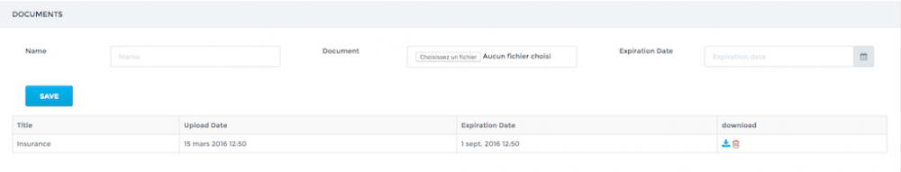
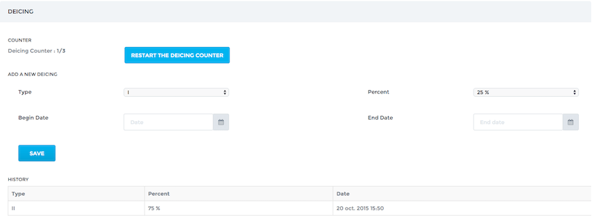
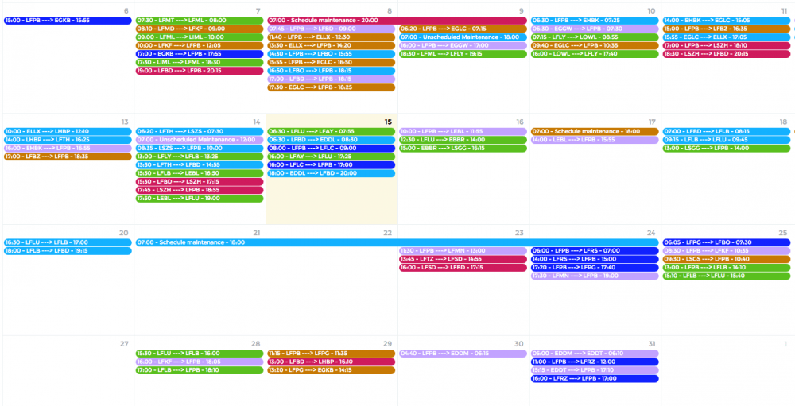

Manage your fleet
=================

Link to CAMP software
---------------------

OpenJet 360 can be linked to your CAMP software, providing an automatic updates of the flight time & cycles counters. Contact support@openjet.com to activate this feature. 

You will have to provide your CAMP connection details and enter the engine details (Serial, hours and cycles) on the aircrafts pages.

Adding an aircraft to your fleet
--------------------------------

Adding an aircraft to your fleet is very easy in OpenJet. Go to the Aircraft -> Aircraft List and click on the Add New button.

Complete the mandatory fields on the form:

- Tail Number.
- Flight Number (should you not use a specific Flight Number for the aircraft, input the tail number again).
- Aircraft Type (see below for aircraft types management).
- Back-office color. Avoid red as it could hide some errors or warnings on the flight list.
- Bases and Default base. You can enter multiple bases if you use multiple commercial bases for one aircraft. Default base is the main base of the aircraft.
- Select Available if you want your aircraft to be available for quoting.
- Select Available for auto-booking if you want your aircraft to be available for the optimization system.

Finally, click Save to validate your new aircraft. You have now access to all sections of your aircraft page.

Documents
---------

Upload any relevant document regarding your aircraft, and add an expiration date if necessary.

De-icing
--------

You can track de-icing history of your aircraft. De-icings can be entered on this page or through de Pilot App, when completing a report. The de-icing counter automatically increases for each reported de-icing, and can be reseted manually.

Aircraft Types
--------------

To add and manage your aircraft types, go to Aircraft -> Company Type List. To add a new type, click on Add New. Choose your type among the list. If the type does not exist yet, contact support@openjet.com to update the list.

Once created, you have access to the different sections to customize the type:

Main
^^^^

Check Available to allow the creation of an aircraft of this type

Characteristics
^^^^^^^^^^^^^^^

In the left columns are the performances data used to calculate flight time. If you need to improve flight time calculation, you can change these values.

Minimum crew
^^^^^^^^^^^^

You can set here the minimum crew number required depending on flight type. This will change the number of “Crew slots” that need to be filled in the flight list, when creating a new flight.

Payload/Autonomy chart
^^^^^^^^^^^^^^^^^^^^^^

This chart is used for the booking part of OpenJet, to only accept realistic bookings (not too far or too heavy).

Photos
^^^^^^

You can upload here photos of the type to be displayed on the OpenJet booking website.

Aircraft Scheduling
-------------------

Go to Aircraft -> Scheduling

This customizable page allows you display monthly planning of your crews. To add an activity, simply click on a cell and fill out the form.

This calendar provides you with an overview of your fleet’s planning. Each leg has the color of the aircraft. Click on a leg to view details. Click on a day to add an aircraft unavailability (e.g. maintenance)

Activities and activity types are customizable. You can manage proposed activities and activity types in the Configure Menu.

Activity types are given a color used in Aircrafts schedules.

Just send a message to support@openet.com should you need to be given rights to administrate Activities and Types.