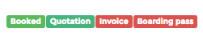
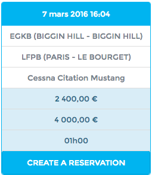
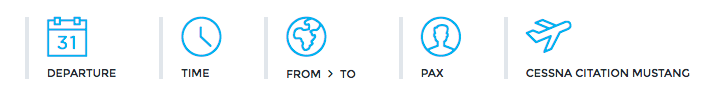

Create and Manage Reservations
==============================

.. note:: All times showed in the reservations, documents and lists are Local Times.

Reservation lists
-----------------

In OpenJet 360, reservations are used to create a quotation, and manage the commercial part of the flight when booked.

The reservation lists display reservations according to the filter used on the list.

The first column displays all legs of the reservation and their departure time:

The last column called Status allows you to have a quick overview of the current state of the reservation.

The first indication is the state of the reservation. Possible states are:

- |status-pending| Reservation has been created but not booked.
- |status-booked| Reservation is booked and is being handled by Ops.
- |status-option| Client has hold the reservation. Ops has received the reservation with an “on hold” status.
- |status-charter| Reservation will be flown by another operator.
- |status-canceled| Reservation has been canceled. Cancellation is possible from any previous state.

The three remaining indications, **Quotation, Invoice** and **Boarding Pass** are red when no such document has been created or if the last document is not up to date (changes made to the reservation).

New estimate
------------

The estimate page allows you to have a quick estimate of the price for a one-way flight without creating a reservation. Previous estimates are visible and ordered by **Most used** and **Last estimates**.

The button **Create a reservation** triggers the new reservation form pre-filled with aircraft type, origin and destination.

Create and edit a reservation
-----------------------------

You can create a new reservation using an estimate or directly on the **New reservation page**. Complete the form with the informations for the first leg and click **Add**.

You will be now redirected to the reservation editing page.

Change reservation status
^^^^^^^^^^^^^^^^^^^^^^^^^

On the top right corner of the page is the reservation status button, allowing you to change the status.

- Try auto-book will trigger the optimzation system and propose an aicraft and a crew. If you book through this, aircraft and crew planning will be automatically changed and empty leg and crew positionning will be added.
- Send to Ops will send the flight to ops with no assignment and change the status to booked
- Option will send the flight to ops with the on hold status
- Cancel will cancel the reservation
- Chartering will switch the status to Charter

Availability
^^^^^^^^^^^^

Next to the status indication, you find a button which triggers the optimisation to verify the availability of the flights.

Once the pending status is over, you will see Available in green or Not available in red.

Edit trip
^^^^^^^^^

The trip is shown in the Flights Section.

To add a leg, use  or  . The second one will trigger the new leg form with departure and arrival already filled. Once you click in ADD, the new leg will be added and the pricing will be recalculated for the entire reservation.

.. note:: Empty legs and overnights are automatically created and quoted based on the trip and aircraft’s base(s).

Next to each leg, different buttons allows you different action on that leg:

Edit leg to change any element of the leg (departure time, airports, pax number).

Remove leg
^^^^^^^^^^

Add Comment will add a text comment to that leg visible by sales and ops.

Price
^^^^^

The Price can be manually changed by clicking on it. You may change the hourly rate, apply or discount or change the leg price directly.

Once changed the old price and the new price will be displayed as follows:  
The profile used for pricing is shown above the price (Default in this example).

Switching pricing Profiles
^^^^^^^^^^^^^^^^^^^^^^^^^^

You can switch between up to three pricing profiles provided you set B2B destination channel for those channels. Switching Pricing Profile will recalculate commercial and empty legs prices and all fees set in the pricing profile.

Details on price
^^^^^^^^^^^^^^^^

You can read the details how the leg price was calculated by hovering over the pie chart next to the price.

Empty legs
^^^^^^^^^^

Empty legs are created depending your current pricing profile. You may delete them with the cross or change their price by clicking on the price.

To add another empty leg, click on  and choose ‘Empty Flight’.

Additional Services
^^^^^^^^^^^^^^^^^^^

Some Additional Services which are part of the pricing will be automatically created (Overnights, Start-up fee etc.). You may delete them or change their price manually in the same way.

To add any other service (e.g. Catering, De-Icing), click on  . Go to page Pricing -> Additional Services page to create or edit an additional service type.

Total
^^^^^

This section will be automatically calculated with the inputs made above. Click on the tax amount the view the detailed taxes.

Currency
^^^^^^^^

You can select a currency and update the exchange rate. Changes are taken into account by clicking on update.

Paying customer
^^^^^^^^^^^^^^^

In this section, you define the paying customer. Enter the name or part of the name in the customer field and press enter or click on the search button. 
If there is no match because the customer does not exist, use Create XXX to directly create a customer without leaving the page. 
A window with the new customer form will appear. 
Fill it and click on create: the new customer will be created and selected for the reservation.

You have the possibility to add a contact to the customer. This will allow you to send the document to several contacts.

Once selected, customer details will be displayed at the top of the reservation. From there, you can change the comments on that customer directly, and have a look at the statistics.

Send Comments
^^^^^^^^^^^^^

These comments will be visible on any leg attached to the reservation. Comments to All are visible by Sales, Ops and Pilot.

Passengers
^^^^^^^^^^

Enter here the passengers. Passengers are handled like customers in OpenJet 360, so follow the same process as for customers to add a new passenger.

Use  to increase passenger number and  to copy the passenger list from the previous leg.

Passenger: 

Click on the star to set the passenger a Lead Passenger. The crew will be notified accordingly on their app.
Click on the bin to remove the passenger from the leg
Click on the name to access the passenger’s profile.
The weight will be the standard weight according to the passenger’s gender or the passenger’s weight if specified on its profile. Contact support@openjet.com to change your standard weights.
By clicking on  , you can enter luggages weight and monitor remaining payload available:

.. warning:: Remaining payload is based on the Payload/autonomy chart set for the aircraft type. It is an indication and should never be considered accurate or reflecting aircraft’s mass & balance data.

Documents
^^^^^^^^^

OpenJet 360 can generate quotations, pro formas, invoice, credit notes and boarding pass automatically according to specific templates.

.. note:: Contact us regarding your need on document templates. We will do our best to match OpenJet’s document to your templates.

Click on New Quotation/Flight Confirmation/Pro Forma/Invoice/Boarding Pass to generate a new document. If anything is changed in the reservation, the up-to-date status will show NO. In case of invoices, a credit note will be generated each time the up-to-date turns to NO.

.. note:: In case of chartering, a new section will appear above the document section, allowing you to override the automatic filling of the documents. The fields are not mandatory. If not filled, the document will show the default information coming from the reservation.

To generate any document, the customer must be set. To generate an invoice or a boarding pass, the status of the reservation must not be pending.

Click on  to view the document in HTML format, or on the ID to download it in PDF format. The envelope symbol on the far right column opens a window allowing you to directly send an email with the document attached.

Operation
^^^^^^^^^

This section displays the operational informations on the flight (Aircraft, Crew, FBO etc…).

Logs
^^^^

All changes made to the reservation are recorded in the log.

