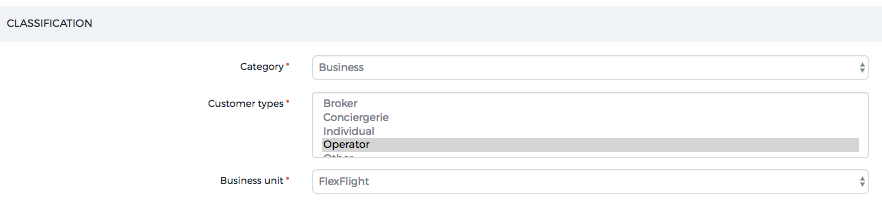
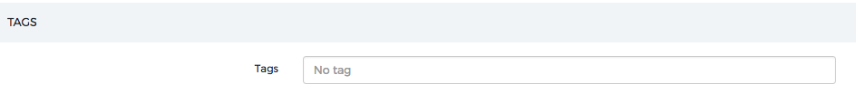

Customer Management
===================

OpenJet 360 provides you with a simple customer list using the menu **Customer > Customer list**. 

Customer are of two kinds: **Account** and **Contact**.

Customer and Passengers are the same in OpenJet, so each passenger you create will also be displayed in this list. To create a new customer or passenger, you can click on **Create New Account/Contact** or create directly in the reservation management page (see Manage reservations).

**Accounts** are for paying customers (whether Individual or Company) and have a full set of information.

**Contacts** are for passengers only with a simpler form.

Account Profile
---------------

Locale
^^^^^^

If your customer’s language is not the default language you have chosen, you can set it to another language.

The documents that you will send to this customer will be in the selected language, if you have provided us with the templates.

Classification
^^^^^^^^^^^^^^

- You can set any customer as being a **Company** or an individual.
- You have to choose a unique Customer Type for the account.
- You can manage Customer Types in **Customer > Customer Types**.
- You can choose for which Business Unit this Customer belongs, if applicable.

Tags
^^^^

Information
^^^^^^^^^^^

.. image::  images/customerinformation.png
    :align: center

**The commercial information you enter is displayed on the reservation page. All information will be visible by ops agents and pilots.**

Historic
^^^^^^^^

At the bottom of the page, you have access to your customer’s historic and link to last reservations.

Linking Accounts and Profiles
^^^^^^^^^^^^^^^^^^^^^^^^^^^^^

In the upper part you can connect your Account/ Contact to other Accounts.

In the bottom of the page, you can add contacts to an account.
