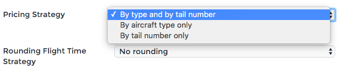

Pricing
=======

Pricing strategy and base airports
----------------------------------

On the page Configure -> General (Admin role) in the Options section, you can choose between 3 pricing modes:

If all your aircraft of the same type are based on the same airport and have a similar pricing, you should use “Pricing by aircraft type only”. The type’s base is set on the page Pricing -> Base airports. If you choose several airport bases, OpenJet 360 will choose the most appropriate one, reducing empty legs.

If your aircrafts of same type are located at different airports, you have two choices:

- Pricing by aircraft type only: OpenJet 360 will automatically choose the aircraft by minimizing empty legs.
- Pricing by tail number only: you have to choose a tail number before making a quotation.

If you choose “Pricing by type and tail number”, you will be able to have both, see pricing profiles for more details.

Just below, you may choose flight time rounding : upper 5 minutes, lower 5 minutes or nearest 5 minutes.

Flight time calculations
------------------------

OpenJet automatically calculates flight times based on direct route between two airports. 
Aircraft performances can be set for each type of your company. See Manage your Fleet.

If you are not satisfied with the flight time between two airports, you can manually set the flight time using the page Pricing -> Manual Flight Time List.

Pricing
-------

On the page Pricing -> Pricing Profiles, you can create, edit and manage pricing profiles.
Click on a profile to edit it.

Copy from profile
^^^^^^^^^^^^^^^^^

You can copy another profile content to this current profile.

General
^^^^^^^

You can set a name for your current pricing profile. You can add destination channels for the current profile:

- B2B is for reservations created from your dedicated Openjet environment. Note that you can have more than one profile for this channel, enabling to switch pricing profiles in one click in reservations.
- B2C is for reservations made directly by End customers on Openjet.com
- Agency is for reservations from a third party : GDS (like Amadeus), Travel agencies, Hotels and Concierges.

The default for this channel option enables to use this profile at reservation creation.

Pricing mode
^^^^^^^^^^^^

Prices in profiles: this option determines if the prices shown in the profile include taxes or if the tax is put on top.

There are four options to show/hide additional services and empty legs from your quotation and invoice.

Rounding
^^^^^^^^

You may choose here how you wish to round your prices and set the rounding precision.

Fixed reservation fee
^^^^^^^^^^^^^^^^^^^^^

This fee will be counted once per quotation.

Airplane price
^^^^^^^^^^^^^^

You can choose to create your pricing for each tail number or for each model of aircraft by enabling the option on the chosen line. 

You need to enter commercial flight price, empty leg price per minute and set the minimum flight time per leg.

Fixed leg fee
^^^^^^^^^^^^^

This fee will apply once for any revenue leg and empty leg if selected.

Daily fee
^^^^^^^^^

This fee will apply for any commenced day (based on departure local time). You have the choice to apply a buffer time, if you don’t want flight arriving early in the morning to be charged a second day.

Airport average price
^^^^^^^^^^^^^^^^^^^^^

This fee covers landing and FBO fee. It applies for each landing, unless specified in airport exceptions.

Airport exceptions
^^^^^^^^^^^^^^^^^^

Enter here the price for an airport for which you don’t want the average price to apply.

Parking per hour fee
^^^^^^^^^^^^^^^^^^^^

You can apply an hourly parking fee on an airport. OpenJet calculates the schedules time on ground and applies the fee hourly. Every started hour is due.

Wait time fee
^^^^^^^^^^^^^

OpenJet calculates the time spent on ground within the reservation and applies this fee hourly. Every started hour is due.

Pax price
^^^^^^^^^

This fee covers the catering or any taxe which is due per passenger. Enter the amount and the first passenger to be charged.

Empty leg price
^^^^^^^^^^^^^^^

Choose here how OpenJet calculates the empty legs:

- No empty Leg
- Simple: for ‘A-B’ trip, create the ‘B-A’ corresponding empty flight
- Base: Create empty legs from/to base before and after commercial leg

Overnight price
^^^^^^^^^^^^^^^

Enter here the price for an overnight and the maximum allowed overnights. 
If the number of overnights is exceeded, empty legs back and from base will be charged.

Immobilisation step one/two
^^^^^^^^^^^^^^^^^^^^^^^^^^^

If the time on ground exceed the step, the fee will be apply.
